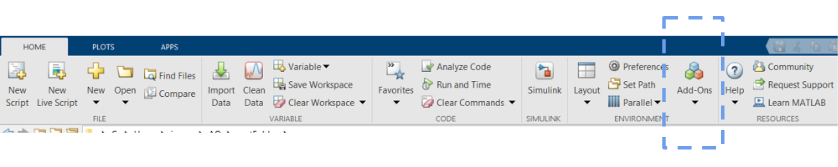
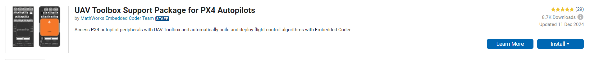
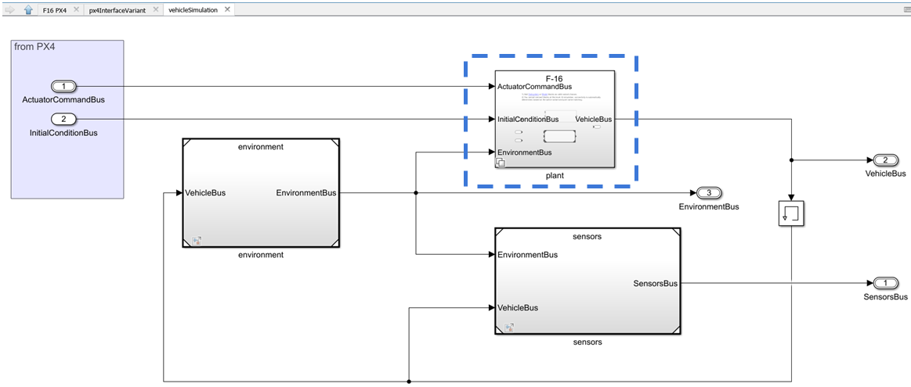
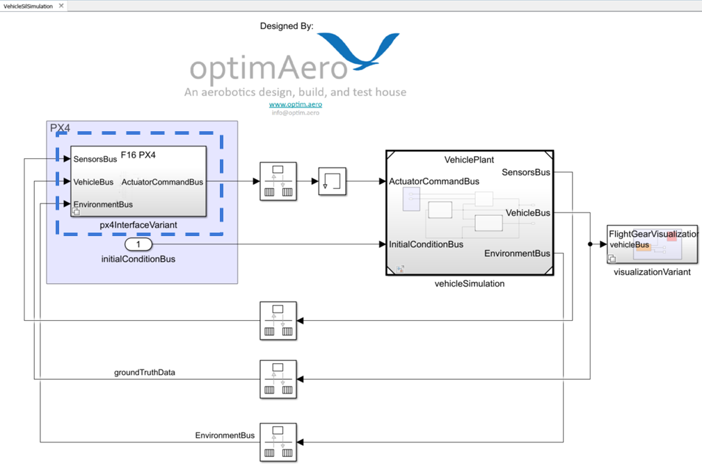
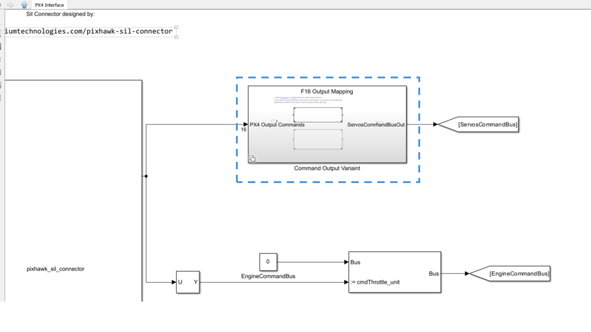
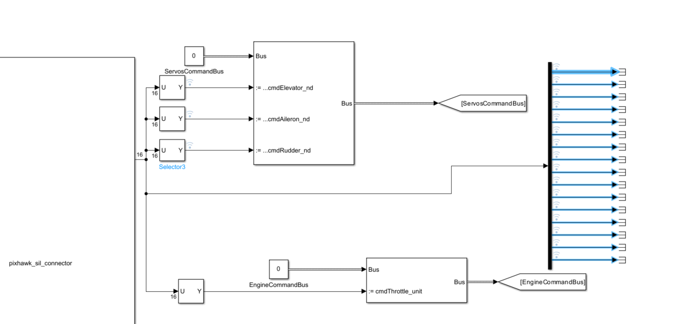

<p>
    
</p>

https://www.optim.aero

info@optim.aero

# optimAero PX4 Simulink SIL Overview

This repository houses a software in the loop (SIL) simulation for an aircraft using the PX4 controller and a Simulink-based physics plant, sensor, and environmental model. The purpose of this SIL is to provide the user with an example of how to connect the PX4 flight controller to a Simulink plant model. The flight controller used in this SIL is a modified PX4 autopilot (V1.14.0). The SIL (`VehicleSilSimulation.slx`) is located in the root directory of the repo. The plant (`VehiclePlant.slx`) is also housed in the root directory. Currently the default plant model is of an F-16 aircraft based on the model provided in <em>Aircraft Control and Simulation THIRD EDITION (STEVENS, LEWIS, JOHNSON)</em>. A custom plant/aircraft can be added by following the instructions below in the <strong> Adding Custom Vehicle Configuration </strong> section. **All simulink models were created using MATLAB 2024a Update 6**.


## Windows installation instructions (NOTE: this will fail on Mac, as Matlab does not support Mac for all required toolboxes):

1. In git bash:

   ```
   git clone (https)
   cd PX4SIL
   git submodule update --init --recursive
   ```
   If working on slow internet/computer use `--depth 1` tag  `git submodule update --init --recursive --depth 1`. The depth 1 tag may be required on slow connections. This will pull the PX4 repository as well. (NOTE: compilation of PX4 will be slow if the PX4-Autopilot subrepo is checked out on the Windows partition. To speed it up, check the PX4-Autopilot repo, NOT THE FULL SIL REPO, out into the WSL root directory on the Linux partition. <strong>NOTE:</strong> If this method is used DO NOT initialize the SIL as stated in the <strong>  Launching SIL AFTER initial setup </strong> section. You must launch PX4 as stated in STEP 10-11 )

2. From an elevated cmd prompt (e.g., run cmd as administrator or use Powershell): 

   Type:
   ```
   ipconfig
   ```
   to get the get L/WAN IP (e.g. 192.168.12.104).  You will use this IP in step 3. This IP is your `simHostIP`.
`
   Then, install WSL by typing the following into the elevated cmd prompt (Note: the SIL has only been tested using Ubuntu <strong>22.04.3 LTS</strong>): 
    ```
   wsl --install
   ```

1. In WSL:
   Type:
    ```
   ifconfig
   ```
   to get eth0's IP (e.g., 192.168.125.73). You will use this IP in step 4. 

   While in WSL, set the environment variable for the PX4 hostname with the WSL IP (your `simHostIP`) you found in step 2: 
    ```
   export PX4_SIM_HOSTNAME=192.168.12.104
   ```
   **NOTE: If PX4 does not connect to Simulink after Step 11, you may need to set this environment variable again**

2. In QGroundControl (QGC):
   QGC may  be installed from: https://github.com/mavlink/qgroundcontrol/releases

   Once opened, click: Application Settings > Comm links, add a link and press connect: 

   - UDP
   - port 18570
   - WSL's eth0 IP (e.g., 192.168.125.73 found in step 3)

<strong>To run the simulation, follow these steps:</strong>

5. Make sure the **Required Matlab Toolboxes** and **Required Support Packages** (listed below) are downloaded in Matlab Add On Manager, Figure 1.
6. You must set up the PX4 build tool chain which can be done through the Matlab setup of the UAV Toolbox Support Package for PX4 Autopilots, Figure 2. https://www.mathworks.com/help/uav/px4/ug/setting-px4-toolchain-ubuntu.html. Otherwise, you can do it via WSL in the folder where you checked out the PX4 repository: ./Tools/setup/ubuntu.sh
   <p>
       
   </p>
   <p>
       <em> Figure 1: Add-On Manager</em>
   </p>
   <p>
       
   </p>
   <p>
       <em> Figure 2: UAV Support Package for PX4</em>
   </p>

7. Open Matlab, run `initVehicleSIL("launchFullSIL",false,"simHostIP", <simHostIP>)` and change the Matlab directory to its containing folder (this script initializes the workspace)
   1. (OPTIONAL) Vehicle visualization can also occur via FlightGear. To download FlightGear follow the instructions in the <strong> Visualization </strong> section below. Once downloaded the `FlightGear` argument can be used when calling the `initVehicleSil` function (e.g.,`initVehicleSIL("launchFullSIL",false,"visualizationType","FlightGear","simHostIP", <simHostIP>)`)
   2. NOTE - If FlightGear does not appear after using the visualization argument, simply  run `runFlightGear.m` in the MATLAB terminal after calling the `initVehicleSIL` function.
8. Open and run the `VehicleSILSimulation.slx` model
9.  While the model is running, open a Windows command prompt and navigate to the PX4-Autopilot submodule inside the repository
10. Launch wsl in the command prompt (`wsl`) and navigate to the PX4-Autopilot repo/subrepo (depending on what you chose in STEP 1)
11. Build the PX4 executable:
```
make px4_sitl_default optimAeroF16
```
Once built, the PX4 executable should connect to the Simulink model. Ensure you run the Simulink file first before attempting to connect the PX4 executable. The Simulink model will report "Initializing" or "waiting to connect on 4560" when it is ready for the PX4 executable to connect.

## Launching SIL AFTER initial setup

After the initial setup, the full SIL can be launched using the `initVehicleSIL` with the `launchFullSIL` argument set to true. Set all arguments as needed. Example: `initVehicleSIL("launchFullSIL",true,"visualizationType","FlightGear")`. If PX4 cannot establish a connection, close the WSL terminal and run the `initVehicleSIL` function using the `simHostIP` argument (example: `initVehicleSIL("launchFullSIL",true,"visualizationType","FlightGear","simHostIP","192.168.50.236")` )

## SIL Connector Notes

The Pixhawk SIL connector is developed by Kiril Boychev and can be found here: <https://www.mathworks.com/matlabcentral/fileexchange/114320-pixhawk-software-in-the-loop-sil-connector-for-simulink>. If the S-Function needs to be remade, and the files are downloaded from the link provided, the asio and mavlink folder along with the `asio.hpp` must be placed inside of a folder named "includes" in order for the make.m file to work properly.

## Unit Tests

Unit tests (UTs) for nearly all of the reference models used in the plant have been created and are stored in the  "testing" folder of each main model folder (i.e., vehicle/testing). All UTs can be run at once using the `testVehicleSIL.m` script (note: `initVehicleSIL(false)` must be run first).

If additional UTs need to be created, the makeHarness function can be used to generate a blank test harness of the model entered into the argument of the function. (see description of makeHarness in the file itself)

## Required Matlab toolboxes

1. Aerospace Toolbox
2. Aerospace Blockset
3. Control System Toolbox
4. Embedded Coder
5. Matlab Coder
6. Simulink
7. Simulink Coder
8. Simulink Test
9. UAV Toolbox

## Required Support Packages

1. UAV Toolbox Support Package for PX4 Autopilots

## Visualization

Installing FlightGear is optional but helps with visualizing flights. Once it is installed with default options, use `"visualizationType" = "FlightGear"`. For instructions on how to download FlightGear, view visualization/Readme.md

## QGroundControl

QGC must be connected in order to use the joystick when flying via PX4. In QGC, the joystick may be set up once PX4 is running and connected to Simulink. Plug in a joystick (an Xbox or PS5 controller has been tested successfully), click the Q in the top left, then Vehicle Setup, then Joystick. Select the correct Active Joystick, and it is recommended to assign some buttons to ARM and ACRO flight mode.

## Adding Custom Vehicle Configuration

To add a custom vehicle configuration, the Simulink model and the PX4 configuration file, along with other files, must be changed.

### Simulink Changes

#### Step 1: Plant Model

A custom vehicle configuration can be added to the Simulink model by adding the vehicle model as a variant to the <em>plant</em> variant block shown in Figure 3. Note the outputs needed from the plant model (<strong> vehicleBus</strong>) must use the same units as the outputs of the F16 plant model.
<p>
    
</p>
<p>
    <em>Figure 3: Plant Variant Model</em>
</p>

#### Step 2: Bus Definition Updates

The <strong>ServosCommandBus</strong> and <strong>ServosBus</strong> must be updated based on the aircraft configuration that is being added. All of the vehicle's actuators (control surfaces, propellers, etc.,) must be added as an element of a sub-bus of the ServosCommandBus bus. The <strong>signals/CustomAircraftS/servosBusDefinitionCustomAircraft.m</strong> and  <strong>signals/CustomAircraftS/servosCommandCustomAircraftBusDefinition.m</strong> files can be modified to include the required signals.

A variant must be added to the <em>PX4 Interface Variant</em> model, Figure 4. This variant must have the correct signals mapped to the <strong>ServosCommandBus</strong> bus assignment block as shown in Figure 5.
<p>
    
</p>
<p>
    <em>Figure 4: PX4 Simulink Varaint</em>
</p>
<p>
    
</p>
<p>
    <em>Figure 5: PX4 Command Mapping</em>
</p>

### PX4 Changes

#### Step 1: Creating Aircraft Configuration File

A configuration file that specifies the frame type of the aircraft as well as other parameters must be created and saved in <strong>\px4-autopilot\ROMFS\px4fmu_common\init.d-posix\airframes</strong>. The <strong>10020_optimAeroF16</strong> and <strong>10016_none-iris</strong> files can be used as examples. More details about vehicle frame types and parameters can be found on PX4's website.

#### Step 2: Adding Aircraft Configuration File

The aircraft configuration file must be added to the <strong>px4-autopilot\ROMFS\px4fmu_common\init.d-posix\airframesCMakeLists.txt</strong> file and the <strong>px4-autopilot\src\modules\simulation\simulator_mavlink\CMakeLists.txt</strong> file must be updated (replace <em>10020_optimAeroF16</em> and anything else associated with that name in the file with the name of the new custom aircraft).

## Known Issues

### Mapping commands from PX4

Mapping the commands from the <strong>pixhawk_sil_connector</strong> to the <strong>ServosCommandBus</strong> can be challenging. One method of figuring out what signals from the pixhawk_sil_connector correspond to the vehicle's actuators is by using a demux to view all 16 signals coming from the first output of the px4_sil_connector as shown in Figure 6, and observing how the signals change given a joystick input.

### Ending the simulation

When ending the simulation after a successful launch, Ctrl+C must be used to end the PX4 autopilot first (in the WSL terminal, press Ctrl+C). If this is not done first, the Simulink model will fail to close and MATLAB will need to be terminated.

### Vehicle parameters

The F16 parameters that should be used when running the simulation can be found here: ROMFS/px4fmu_common/init.d-posix/airframes/10020_optimAeroF16. In some cases, these parameters are not properly loaded into QGC. If that occurs, the parameters will need to be updated. manually.

### Simulink fail to launch

In some cases Simulink my fail to run and Matlab/Simulink may crash. If this happens multiple times, delete the work folder in the repo and re-launch the Simulink model

<p>
    
</p>
<p>
    <em>Figure 6: Demux command signals</em>
</p>
