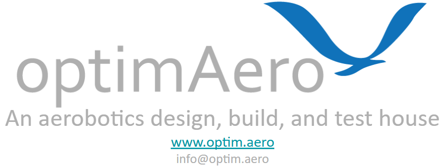

<p align="center">
    
<p align="center">

<p align="center">https://www.optim.aero</p>
<p align="center">info@optim.aero</p>

<strong>Simulator Preview Video</strong>: (Click to view)

<p align="center">
  <a href="https://www.youtube.com/watch?v=h17urCZkXF8">
    
  </a>
</p>

# optimAero PX4 Simulink SIL Overview

This repository houses a software in the loop (SIL) simulation for an aircraft using the PX4 controller and a Simulink-based physics plant, sensor, and environmental model. The purpose of this SIL is to provide the user with an example of how to connect the PX4 flight controller to a Simulink plant model. The flight controller used in this SIL is a modified PX4 autopilot (V1.14.0). The SIL (`VehicleSilSimulation.slx`) is located in the root directory of the repo. The plant (`VehiclePlant.slx`) is also housed in the root directory. Currently there are two plant models to chose from, a F-16, and the Palledrone, a 250 Group-3 hexarotor UAS. The F-16 is based on the model provided in <em>Aircraft Control and Simulation THIRD EDITION (STEVENS, LEWIS, JOHNSON)</em>, and the Palledrone model is based on the Group-3 UAS developed by RotorX discussed in [<strong>The development and flight testing of a group-3, ultra-lift, UAS for the research and development sector</strong>](https://arc.aiaa.org/doi/abs/10.2514/6.2022-3636). A custom plant/aircraft can be added by following the instructions below in the <strong> Adding Custom Vehicle Configuration </strong> section. **All simulink models were created using MATLAB 2024a Update 6**.

## Windows installation instructions (NOTE: this will fail on Mac, as Matlab does not support Mac for all required toolboxes):

<p align="center">
  <a href="https://www.youtube.com/watch?v=7plK3ksYY64">
    
  </a>
</p>

1. In git bash:

   ```
   git clone https://github.com/optimAero/optimAeroPX4SIL.git
   cd optimAeroPX4SIL
   git submodule update --init --recursive
   ```
   If working on slow internet/computer use `--depth 1` tag  `git submodule update --init --recursive --depth 1`. The depth 1 tag may be required on slow connections. This will pull the PX4 repository as well. (NOTE: Compilation of PX4 will be slow because the PX4-Autopilot subrepo is checked out on the Windows partition. To speed it up, complete <strong>Step 2</strong> first and then clone the PX4-Autopilot repo, NOT THE FULL SIL REPO, into the WSL root directory on the Linux partition using the following command while in the WSL root directory):

   ```
   git clone --branch OAPX4SIL-Hex --single-branch git@github.com:optimAero/PX4-Autopilot.git
   ```

2. From an elevated cmd prompt (e.g., run cmd as administrator or use Powershell): 

   Type:
   ```
   ipconfig
   ```
   to get the get L/WAN IP (e.g. 192.168.12.104).  You will use this IP in step 3. This IP is your `simHostIP`.
`
   Then, install WSL by typing the following into the elevated cmd prompt (Note: the SIL has only been tested using Ubuntu <strong>22.04.3 LTS</strong>): 
    ```
   wsl.exe --install Ubuntu-22.04
   ```

1. In WSL:
   Type:
    ```
   ifconfig
   ```
   to get eth0's IP (e.g., 192.168.125.73). You will use this IP in step 4. 

   While in WSL, set the environment variable for the PX4 hostname with the WSL IP (your `simHostIP`) you found in step 2: 
    ```
   export PX4_SIM_HOSTNAME=192.168.12.104
   ```
   **NOTE: If PX4 does not connect to Simulink after Step 11, you may need to set this environment variable again**

2. In QGroundControl (QGC):
   QGC may  be installed from: https://github.com/mavlink/qgroundcontrol/releases

   Once opened, click: Application Settings > Comm links, add a link and press connect: 

   - UDP
   - port 18570
   - WSL's eth0 IP (e.g., 192.168.125.73 found in step 3)

<strong>To run the simulation, follow these steps:</strong>

5. Make sure the **Required Matlab Toolboxes** (listed below) are downloaded in Matlab Add On Manager, Figure 1.

6. You must set up the PX4 build tool chain which can be done using the following command via WSL in the folder where you checked out the PX4 repository:
```
 ./Tools/setup/ubuntu.sh
```

7. Open Matlab, run `initVehicleSIL("launchFullSIL",false,"simHostIP", <simHostIP>)` and change the Matlab directory to its containing folder (this script initializes the workspace)
   1. (OPTIONAL) Vehicle visualization can also occur via FlightGear. To download FlightGear follow the instructions in the <strong> Visualization </strong> section below. Once downloaded the `FlightGear` argument can be used when calling the `initVehicleSil` function (e.g.,`initVehicleSIL("launchFullSIL",false,"visualizationType","FlightGear","simHostIP", <simHostIP>)`)
   2. NOTE - If FlightGear does not appear after using the visualization argument, simply  run `runFlightGear.m` in the MATLAB terminal after calling the `initVehicleSIL` function.
8. Open and run the `VehicleSILSimulation.slx` model
9.  While the model is running, open a Windows command prompt and navigate to the PX4-Autopilot submodule inside the repository
10. Launch wsl in the command prompt (`wsl`) and navigate to the PX4-Autopilot repo/subrepo (depending on what you chose in STEP 1)
11. Build the PX4 executable:
```
make px4_sitl_default optimAeroF16
```
or
```
make px4_sitl_default optimAeroHex
```
Once built, the PX4 executable should connect to the Simulink model. Ensure you run the Simulink file first before attempting to connect the PX4 executable. The Simulink model will report "Initializing" or "waiting to connect on 4560" when it is ready for the PX4 executable to connect.

## Launching SIL AFTER initial setup

After the initial setup, the full SIL can be launched using the `initVehicleSIL` with the `launchFullSIL` argument set to true. Set all arguments as needed. Example: `initVehicleSIL("launchFullSIL", true, "vehicleType", "hexarotor", "visualizationType", "FlightGear")`. If PX4 cannot establish a connection, close the WSL terminal and run the `initVehicleSIL` function using the `simHostIP` argument (example: `initVehicleSIL("launchFullSIL",true, "vehicleType", "hexarotor","visualizationType","FlightGear","simHostIP","192.168.50.236")` ). <strong>If the PX4-Autopilot repo has been cloned on the WSL root directory use the `"PX4InWSL",true` argument.</strong>

## SIL Connector Notes

The Pixhawk SIL connector is developed by Kiril Boychev and can be found here: <https://www.mathworks.com/matlabcentral/fileexchange/114320-pixhawk-software-in-the-loop-sil-connector-for-simulink>. If the S-Function needs to be remade, and the files are downloaded from the link provided, the asio and mavlink folder along with the `asio.hpp` must be placed inside of a folder named "includes" in order for the make.m file to work properly.

## Unit Tests

Unit tests (UTs) for nearly all of the reference models used in the plant have been created and are stored in the  "testing" folder of each main model folder (i.e., vehicle/testing). All UTs can be run at once using the `testVehicleSIL.m` script (note: `initVehicleSIL(false)` must be run first).

If additional UTs need to be created, the makeHarness function can be used to generate a blank test harness of the model entered into the argument of the function. (see description of makeHarness in the file itself)

## Required Matlab toolboxes

1. Aerospace Toolbox
2. Aerospace Blockset
3. Simulink
4. Simulink Test (For running the unit tests)
5. UAV Toolbox
6. Instrument control toolbox
7. MATLAB Support for MinGW-w64 C/C++/Fortran Compiler

## Visualization

Installing FlightGear is optional but helps with visualizing flights. Once it is installed with default options, use `"visualizationType" = "FlightGear"`. For instructions on how to download FlightGear, view visualization/Readme.md

## QGroundControl

QGC must be connected in order to use the joystick when flying via PX4. In QGC, the joystick may be set up once PX4 is running and connected to Simulink. Plug in a joystick (an Xbox or PS5 controller has been tested successfully), click the Q in the top left, then Vehicle Setup, then Joystick. Select the correct Active Joystick, and it is recommended to assign some buttons to ARM and ACRO flight mode.

## Failure Injections and Joystick Button Mapping

### Hexarotor

Each motor of the hexarotor can be failed by using the argument `"failureType","motor1"` when running the `initVehicleSIL` function. Note, the failureType must match the vehicleType (i.e, `motor1` failure type must be used when `vehicleType` is `hexarotor`) or you will get an error. Only one motor can be failed at a time and the failures are lathcing, meaning they cannot be removed once triggered during the sim. To remove the failure the Simulator must be restarted. 

### F-16

The ailerons, rudder, elevator and engine of the F-16 can be failed by inputing `ailerons`, `rudder`, `elevator`, or `engine` for the `failureType` argument. For the control surfaces the failure emulates a jammed control surface, meaning the control surface will maintain its current deflection angle. These failures are also latching. The engine failure simply cuts the engine off. 

### Mapping failure injection to your joystick

Failures are injected into the simulation using a chosen button on your joystick. To pick which button on your joystick will trigger the failure, simply set the the `assignFailureButton` argument to `true` when running the `intiVehicleSIL` function. You will be promoted to <strong>HOLD</strong> the joystick button and while holding the button, and while the matlab terminal is selected, press the space button. If successful, you will see a the following printed to the terminal: `Failure injection button has been mapped!`.

## Adding Custom Vehicle Configuration

To add a custom vehicle configuration, the Simulink model and the PX4 configuration file, along with other files, must be changed.

### Simulink Changes

#### Step 1: Plant Model

A custom vehicle configuration can be added to the Simulink model by adding the vehicle model as a variant to the <em>plant</em> variant block shown in Figure 3. Note the outputs needed from the plant model (<strong> vehicleBus</strong>) must use the same units as the outputs of the F16 plant model.
<p>
    
</p>
<p>
    <em>Figure 3: Plant Variant Model</em>
</p>

#### Step 2: Bus Definition Updates

The <strong>ServosCommandBus</strong> and <strong>ServosBus</strong> must be updated based on the aircraft configuration that is being added. All of the vehicle's actuators (control surfaces, propellers, etc.,) must be added as an element of a sub-bus of the ServosCommandBus bus. The <strong>signals/CustomAircraftS/servosBusDefinitionCustomAircraft.m</strong> and  <strong>signals/CustomAircraftS/servosCommandCustomAircraftBusDefinition.m</strong> files can be modified to include the required signals.

A variant must be added to the <em>PX4 Interface Variant</em> model, Figure 4. This variant must have the correct signals mapped to the <strong>ServosCommandBus</strong> bus assignment block as shown in Figure 5.
<p>
    
</p>
<p>
    <em>Figure 4: PX4 Simulink Varaint</em>
</p>
<p>
    
</p>
<p>
    <em>Figure 5: PX4 Command Mapping</em>
</p>

### PX4 Changes

#### Step 1: Creating Aircraft Configuration File

A configuration file that specifies the frame type of the aircraft as well as other parameters must be created and saved in <strong>\px4-autopilot\ROMFS\px4fmu_common\init.d-posix\airframes</strong>. The <strong>10020_optimAeroF16</strong> and <strong>10016_none-iris</strong> files can be used as examples. More details about vehicle frame types and parameters can be found on PX4's website.

#### Step 2: Adding Aircraft Configuration File

The aircraft configuration file must be added to the <strong>px4-autopilot\ROMFS\px4fmu_common\init.d-posix\airframesCMakeLists.txt</strong> file and the <strong>px4-autopilot\src\modules\simulation\simulator_mavlink\CMakeLists.txt</strong> file must be updated (replace <em>10020_optimAeroF16</em> and anything else associated with that name in the file with the name of the new custom aircraft).

## Known Issues

### Ending the simulation

When ending the simulation after a successful launch, Ctrl+C must be used to end the PX4 autopilot first (in the WSL terminal, press Ctrl+C). If this is not done first, the Simulink model will fail to close and MATLAB will need to be terminated.

### Vehicle parameters

The F16 parameters that should be used when running the simulation can be found here: `ROMFS/px4fmu_common/init.d-posix/airframes/10020_optimAeroF16` and the hexarotor paramters are in the same folder with the file name `10021_optimAeroHex`. In some cases, these parameters are not properly loaded into QGC. If that occurs, the parameters will need to be updated. manually.

### Simulink fail to launch

In some cases Simulink my fail to run and Matlab/Simulink may crash. If this happens multiple times, delete the work folder in the repo and re-launch the Simulink model


### Simulink has initialized but PX4 has not

In some cases, if Simulink is initializing and PX4 has not been initialized, you will not be able to close or use MATLAB. Unfortunately, in this case, MATLAB must be killed using Task Manager. 

### PX4 Build errors

You may encounter issues when building PX4 for the first time, for example:`module 'em' has no attribute 'RAW_OPT'`. Which may require you to update or install certain python packages as shown below:

```
pip install empy==3.3.4
```

### matPlotLib Issue

If you see the below error while building PX4, a change to the `Tools/setup/requirements.txt`, as shown in Figure 6 must be made. 

ERROR: Invalid requirement: 'matplotlib>=3.0.': . suffix can only be used with == or != operators
    matplotlib>=3.0.*
              ~~~~~~^ (from line 11 of optimAeroPX4SIL/PX4-Autopilot/Tools/setup/requirements.txt
<p>
    
</p>
<p>
    <em>Figure 6: MatlabPlotlib Fix</em>

</p>
